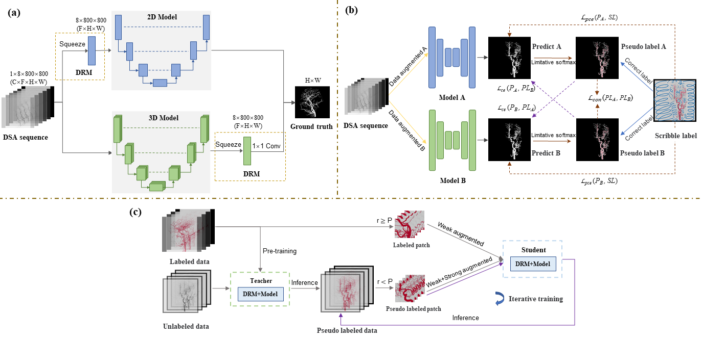

# DIAS: A Comprehensive Benchmark for DSA-sequence Intracranial Artery Segmentation
This repository is the official PyTorch code for the paper [DIAS: A Comprehensive Benchmark for DSA-sequence Intracranial Artery Segmentation](https://arxiv.org/pdf/2306.12153.pdf).
<!-- This repository is the official PyTorch code for the paper '[PHTrans: Parallelly Aggregating Global and Local Representations for Medical Image Segmentation](https://arxiv.org/abs/2203.04568)' (Wentao Liu, Tong Tian, Weijin Xu, Huihua Yang, and Xipeng Pan) -->
New! [DIAS](https://drive.google.com/file/d/14LGnSEVpySNN4KJqhaI-n2YvEh4RTH3Q/view?usp=drive_link) is publicly available!
We will release the tutorial soon.

  

