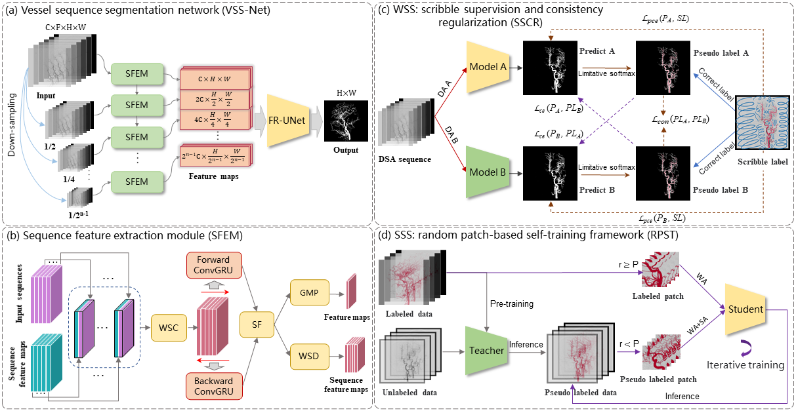

# DIAS: A Comprehensive Benchmark for DSA-sequence Intracranial Artery Segmentation
This repository is the official PyTorch code for the paper [DIAS: A Comprehensive Benchmark for DSA-sequence Intracranial Artery Segmentation](https://arxiv.org/pdf/2306.12153.pdf).
Thank you for your interest. Once our work is accepted, the dataset will be made public.

  

## To be continued

